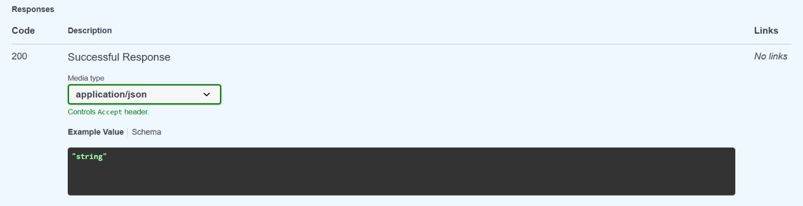
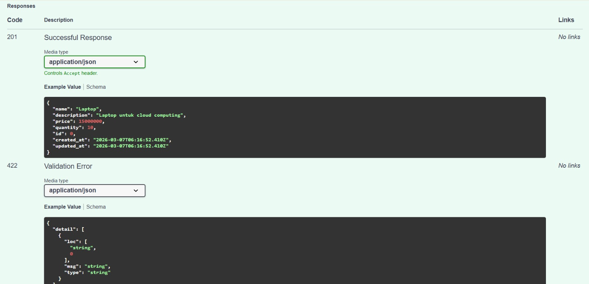
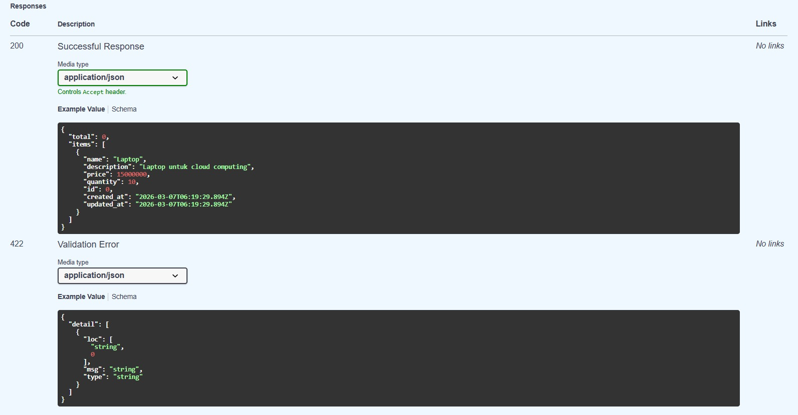
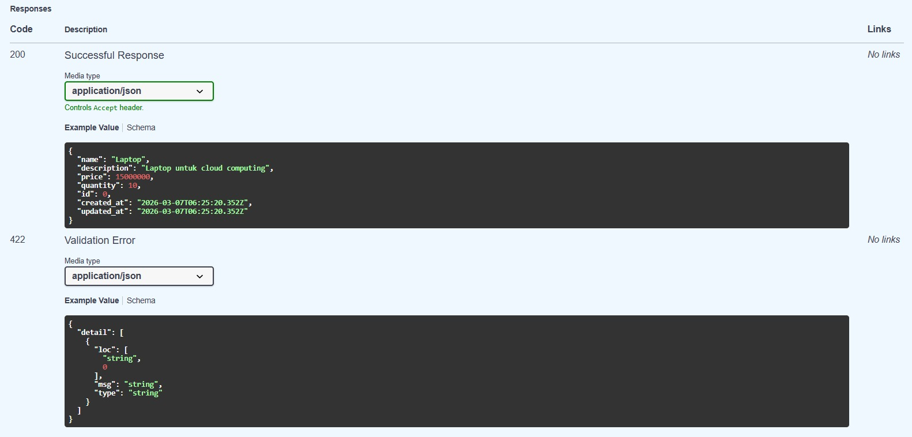
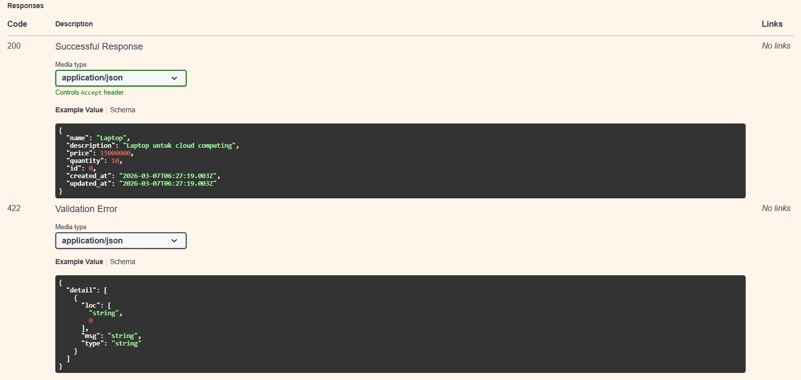
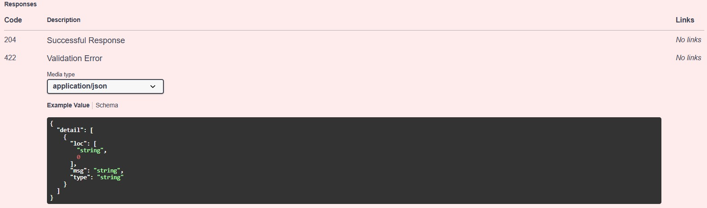
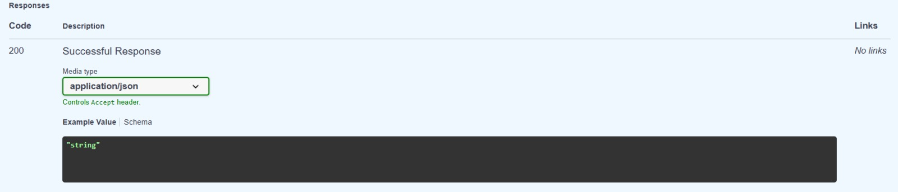

# ☁️ Cloud App - Kelarin

Kelarin merupakan sistem manajemen tugas berbasis cloud yang dirancang untuk membantu mahasiswa dalam mengelola tugas akademik secara terstruktur dan kolaboratif. Dengan Kelarin, pengguna dapat menambahkan tugas, menentukan deadline, serta membagikannya kepada anggota tim sehinggaa seluruh anggota dapat memantau dan mengerjakan tugas secara bersama-sama.

Kelarin ditujukan untuk mahasiswa yang sering kali mengalami permasalahan kesulitan dalam mengatur tugas bersama, seperti tugas yang tidak terdokumentasi dengan baik, pembagian peran yang tidak jelas, atau keterlambatan penyelesaian tugas. Melalui penggunaan sistem ini, seluruh data tugas disimpan secara terpusat pada cloud, sehingga dapat diakses kapan saja dan di mana saja. Dengan demikian, proses kerja kelompok menjadi lebih terorganisir, transparan, dan efisien. 

## 👥 ETHEREAL TEAM

| Nama | NIM | Peran |
|------|-----|-------|
| Tiya Mitra Ayu  | 10231088 | Lead Backend |
| Amazia Devid Saputra  | 10231013 | Lead Frontend |
| Alsha Dwi Cahya  | 10231011 | Lead DevOps |
| Andini Permata Sari  | 10231015 | Lead QA & Docs |
| Ansellma Tita Pakartiwuri P  | 10231017 | Lead CI/CD & Deploy |

## 🛠️ Tech Stack

| Teknologi | Fungsi |
|-----------|--------|
| FastAPI   | Backend REST API |
| React     | Frontend SPA |
| PostgreSQL | Database |
| Docker    | Containerization |
| GitHub Actions | CI/CD |
| Railway/Render | Cloud Deployment |

## 🏗️ Architecture

```
[Client / User]
       |
     (HTTPS)
       |
       v
[React Frontend (Vite)]  <--- REST API --->  [FastAPI Backend]
                                                 |
                              ---------------------------------
                              |                               |
                           (SQL / ORM)                    (API / SDK)
                              |                               |
                              v                               v
                        [PostgreSQL]                    [Cloud Storage]
                  (Data User, Task, Status)        (Optional: File Attachment)
```
**Penjelasan Arsitektur**

Client / User
Pengguna mengakses aplikasi Kelarin melalui browser menggunakan protokol HTTPS untuk memastikan komunikasi yang aman.

React Frontend (Vite)
Frontend berfungsi sebagai antarmuka pengguna yang menangani tampilan dashboard, manajemen tugas, serta interaksi user. Frontend berkomunikasi dengan backend melalui REST API.

FastAPI Backend
Backend bertanggung jawab dalam logika bisnis aplikasi seperti autentikasi, pengelolaan tugas (CRUD), pembaruan status, serta pengolahan data sebelum disimpan ke database atau cloud storage.

PostgreSQL
Digunakan untuk menyimpan data terstruktur seperti data pengguna, daftar tugas, status, dan deadline.

Cloud Storage
Digunakan jika terdapat fitur upload file seperti lampiran tugas atau bukti penyelesaian.

## 🚀 Getting Started

### 📋 Prasyarat
- **Python 3.10+**
- **Node.js 18+**
- **Git**

---

### 🛠️ Tech Stack

#### Backend
| Komponen | Teknologi | Deskripsi |
| :--- | :--- | :--- |
| **Language** | Python 3.10+ | Bahasa pemrograman utama |
| **Framework** | FastAPI | REST API server (High performance) |
| **Database** | PostgreSQL | Penyimpanan data relasional |
| **API Gateway** | Nginx | Reverse proxy & routing |

#### Frontend
| Komponen | Teknologi | Deskripsi |
| :--- | :--- | :--- |
| **Library** | React.js | User Interface library |
| **Build Tool** | Vite | Frontend tooling & bundling (SPA) |

#### DevOps & Deployment
| Komponen | Teknologi | Deskripsi |
| :--- | :--- | :--- |
| **Container** | Docker | Packaging aplikasi |
| **Orchestration**| Docker Compose | Multi-container management |
| **CI/CD** | GitHub Actions | Automated test & deploy |
| **Cloud** | Railway | Hosting & deployment platform |

---

### Backend
```bash
cd backend
pip install -r requirements.txt
uvicorn main:app --reload --port 8000
```

### Frontend
```bash
cd frontend
npm install
npm run dev
```

## 📅 Roadmap

| Minggu | Target | Status |
|--------|--------|--------|
| 1 | Setup & Hello World | ✅ |
| 2 | REST API + Database | ⬜ |
| 3 | React Frontend | ⬜ |
| 4 | Full-Stack Integration | ⬜ |
| 5-7 | Docker & Compose | ⬜ |
| 8 | UTS Demo | ⬜ |
| 9-11 | CI/CD Pipeline | ⬜ |
| 12-14 | Microservices | ⬜ |
| 15-16 | Final & UAS | ⬜ |

## Project Structure
```
cc-kelompok-ethereal_a/
├── backend/
│   ├── crud.py
│   ├── database.py
│   ├── main.py
│   ├── models.py
│   ├── requirements.txt
│   ├── schemas.py
│   └── setup.sh
├── frontend/
│   ├── node_modules/
│   ├── public/
│   │   └── vite.svg
│   ├── src/
│   │   ├── assets/
│   │   │   └── react.svg
│   │   ├── App.css
│   │   ├── App.jsx
│   │   ├── index.css
│   │   └── main.jsx
│   ├── .gitignore
│   ├── eslint.config.js
│   ├── index.html
│   ├── package-lock.json
│   ├── package.json
│   ├── README.md
│   └── vite.config.js
├── .gitignore
├── package-lock.json
└── README.md
```

# setup.sh
setup.sh adalah script otomatis untuk menyiapkan environment project.


# Dokumentasi Endpoint

## GET/Healt


URL: http://localhost:8000/health

Body Request:
```
{
  "status": "healthy",
  "version": "0.2.0"
}
```

Response Example: 
```
"string"
```

## POST/Items


URL: http://localhost:8000/items

Body Request:
```
{
  "name": "Laptop",
  "description": "Laptop untuk cloud computing",
  "price": 15000000,
  "quantity": 10,
  "id": 1,
  "created_at": "2026-03-07T14:16:52.193380+08:00",
  "updated_at": null
}
```

Response Example: 
```
{
  "detail": [
    {
      "loc": [
        "string",
        0
      ],
      "msg": "string",
      "type": "string"
    }
  ]
}
```

## GET/Items


URL: http://localhost:8000/items?skip=0&limit=20

Body Request:
```
{
  "total": 1,
  "items": [
    {
      "name": "Laptop",
      "description": "Laptop untuk cloud computing",
      "price": 15000000,
      "quantity": 10,
      "id": 1,
      "created_at": "2026-03-07T14:16:52.193380+08:00",
      "updated_at": null
    }
  ]
}
```

Response Example: 
```
{
  "detail": [
    {
      "loc": [
        "string",
        0
      ],
      "msg": "string",
      "type": "string"
    }
  ]
}
```

## GET/Item/stats


URL: http://localhost:8000/items/stats

Response Example: 
```
"string"
```


## GET/Items/{item_id}


URL: http://localhost:8000/items/1

Body Request:
```
{
  "name": "Laptop",
  "description": "Laptop untuk cloud computing",
  "price": 15000000,
  "quantity": 10,
  "id": 1,
  "created_at": "2026-03-07T14:16:52.193380+08:00",
  "updated_at": null
}
```

Response Example: 
```
{
  "detail": [
    {
      "loc": [
        "string",
        0
      ],
      "msg": "string",
      "type": "string"
    }
  ]
}
```

## PUT/Items/{item_id}


URL: http://localhost:8000/items/1

Body Request:
```
{
  "name": "Laptop",
  "description": "Laptop untuk cloud computing",
  "price": 15000000,
  "quantity": 10,
  "id": 0,
  "created_at": "2026-03-07T06:25:20.352Z",
  "updated_at": "2026-03-07T06:25:20.352Z"
}
```

Response Example: 
```
{
  "detail": [
    {
      "loc": [
        "string",
        0
      ],
      "msg": "string",
      "type": "string"
    }
  ]
}
```

## DELETE/Item


URL: http://localhost:8000/items/1 

Example Value: 
```
{
  "detail": [
    {
      "loc": [
        "string",
        0
      ],
      "msg": "string",
      "type": "string"
    }
  ]
}
```

## GET/team


URL:  http://localhost:8000/team

Body Request:
```
{
  "team": "cloud-team-XX",
  "members": [
    {
      "name": "Amazia Devid",
      "nim": "10231013",
      "role": "Lead Frontend"
    },
    {
      "name": "Andini Permata Sari",
      "nim": "10231015",
      "role": "Lead QA & Docs"
    },
    {
      "name": "Alsha Dwi Cahya",
      "nim": "10231011",
      "role": "Lead Container"
    },
    {
      "name": "Ansellma Tita Pakartiwuri Putri",
      "nim": "10231017",
      "role": "Lead Deploy & CI/CD"
    },
    {
      "name": "Tiya Mitra Ayu",
      "nim": "10231088",
      "role": "Lead Backend"
    }
  ]
}
```

Response Example: 
```
"string"
```

