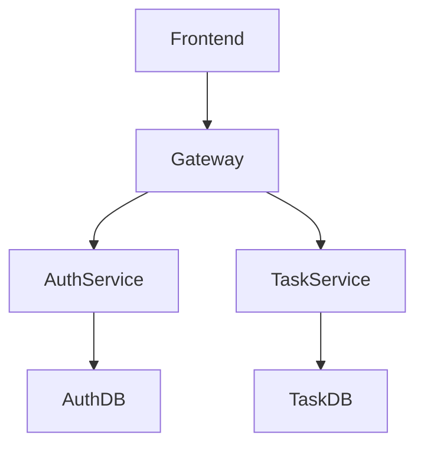
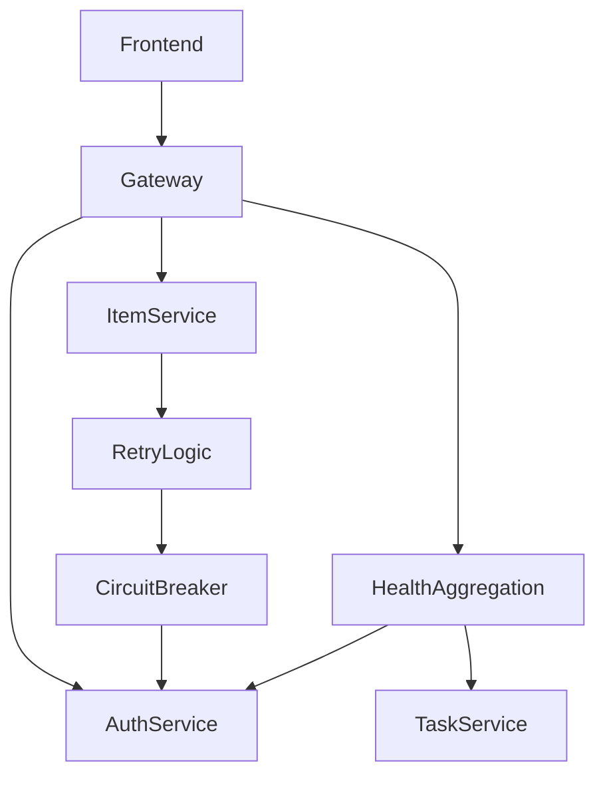
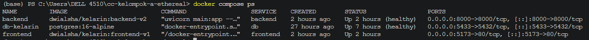
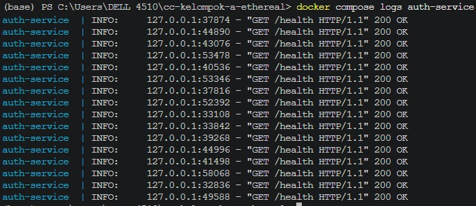
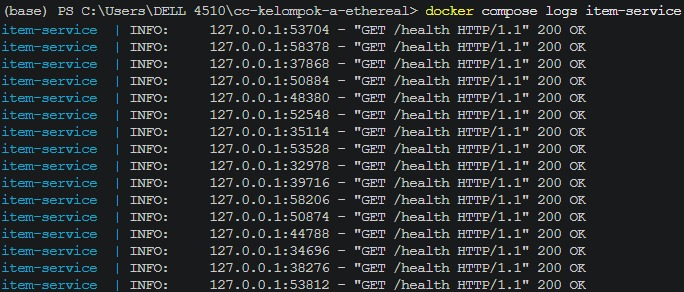
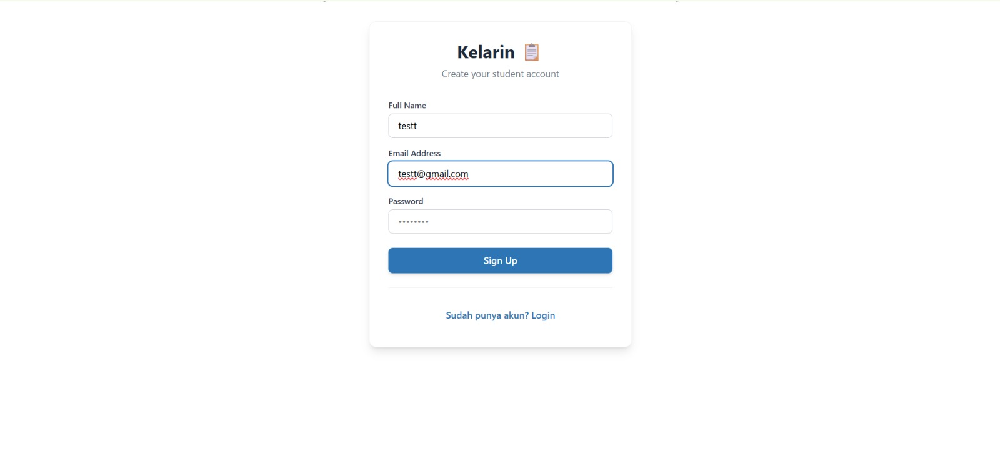
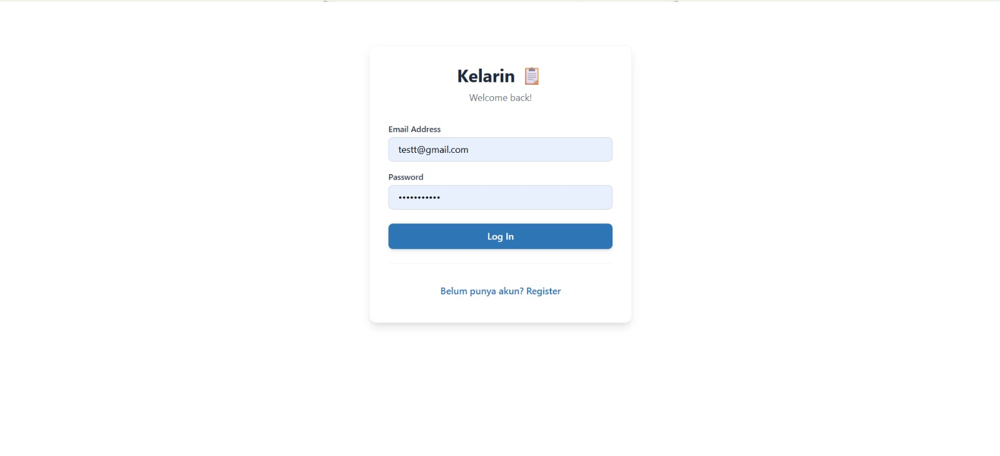
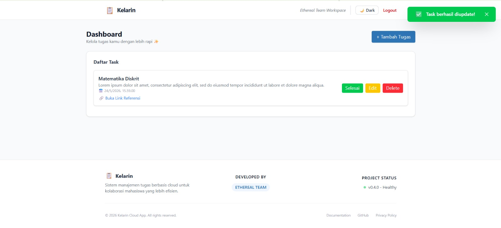
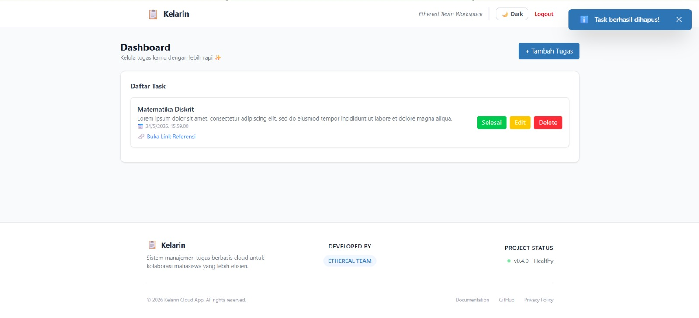
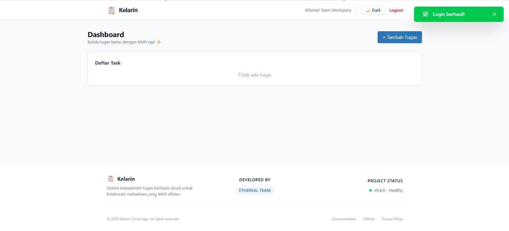

# Microservices Architecture Documentation

## 1. Introduction

Dokumentasi ini dibuat untuk menjelaskan implementasi arsitektur microservices pada aplikasi Kelarin.  
Pada modul ini, backend monolith dipecah menjadi beberapa service independen agar sistem lebih modular, scalable, dan mudah dikelola.

Arsitektur microservices pada project ini terdiri dari:
- Auth Service
- Tasks Service
- API Gateway (Nginx)
- Database terpisah untuk setiap service
- Frontend Application

---

# 2. Architecture Overview

## Microservices Architecture Diagram



---

# 3. Service Overview

| Service | Port | Description |
|----------|------|-------------|
| Frontend | 80 | User interface aplikasi |
| Gateway (Nginx) | 80 | API Gateway dan reverse proxy |
| Auth Service | 8001 | Authentication dan authorization service |
| Task Service | 8002 | CRUD item management |
| Auth Database | 5432 | Database khusus authentication |
| Tasks Database | 5432 | Database khusus task service |

---

# 4. API Contract

## Auth Service

| Method | Endpoint | Description |
|---------|-----------|-------------|
| POST | `/register` | Register user baru |
| POST | `/login` | Login user |
| GET | `/verify` | Verifikasi JWT token |
| GET | `/health` | Healthcheck auth-service |

---

## Task Service

| Method | Endpoint | Description |
|---------|-----------|-------------|
| GET | `/tasks` | Menampilkan seluruh task |
| POST | `/tasks` | Menambahkan task baru |
| PUT | `/tasks/{id}` | Mengubah task |
| DELETE | `/tasks/{id}` | Menghapus task |
| GET | `/health` | Healthcheck task-service |

---

# 5. Docker Compose Workflow

| Command | Description |
|----------|-------------|
| `docker compose up --build` | Menjalankan seluruh container microservices |
| `docker compose down` | Menghentikan seluruh container |
| `docker compose ps` | Melihat status container |
| `docker compose logs auth-service` | Melihat logs auth-service |
| `docker compose logs item-service` | Melihat logs item-service |

---

# 6. Healthcheck & Monitoring

## Health Endpoint

| Service | Endpoint | Status |
|----------|-----------|--------|
| Auth Service | `/health` | ✅ Active |
| Task Service | `/health` | ✅ Active |

---

## Monitoring Logs

| Command | Function |
|----------|----------|
| `docker compose logs auth-service` | Monitoring auth-service |
| `docker compose logs task-service` | Monitoring item-service |

---

# 7. Reliability Mechanisms

Untuk meningkatkan keandalan sistem microservices, aplikasi Kelarin menerapkan beberapa mekanisme reliability agar layanan tetap dapat beroperasi ketika terjadi gangguan pada salah satu service.

---

## Retry Logic

Retry Logic digunakan ketika Item Service gagal berkomunikasi dengan Auth Service akibat gangguan sementara seperti timeout, keterlambatan jaringan, atau service yang belum siap menerima request.

Saat terjadi kegagalan komunikasi, sistem akan mencoba kembali request beberapa kali sebelum mengembalikan error kepada pengguna.

### Tujuan

- Mengatasi kegagalan sementara (temporary failure).
- Meningkatkan keberhasilan komunikasi antar service.
- Mengurangi kemungkinan request gagal akibat service belum siap.

### Workflow

```text
Item Service
      |
      v
Auth Service
      |
    Gagal
      |
Retry Request
      |
    Berhasil
      |
Response ke User
```

---

## Circuit Breaker

Circuit Breaker digunakan untuk mencegah Item Service terus mengirim request ke Auth Service yang sedang mengalami gangguan.

Apabila jumlah kegagalan komunikasi telah melewati batas tertentu, Circuit Breaker akan memblokir sementara request berikutnya sehingga sistem tidak mengalami overload dan timeout berulang.

### State Circuit Breaker

| State | Description |
|---------|-------------|
| CLOSED | Semua request diteruskan ke service tujuan |
| OPEN | Request langsung ditolak karena service dianggap bermasalah |
| HALF-OPEN | Sistem mencoba mengirim request percobaan untuk memeriksa apakah service sudah pulih |

### Tujuan

- Menghindari cascading failure antar service.
- Mengurangi timeout yang berulang.
- Mempercepat response ketika dependency sedang tidak tersedia.

---

## Health Aggregation

Health Aggregation digunakan untuk memantau kondisi seluruh service melalui satu endpoint monitoring terpusat.

Gateway akan mengumpulkan status kesehatan dari beberapa service dan menampilkan kondisi sistem secara keseluruhan.

### Service yang Dipantau

| Service | Health Endpoint |
|----------|----------------|
| Auth Service | `/health` |
| Task Service | `/health` |

### Tujuan

- Mempermudah monitoring sistem.
- Mempercepat proses troubleshooting.
- Memberikan informasi kesehatan sistem secara menyeluruh.
- Membantu proses deployment dan observability.

---

## Reliability Architecture Flow



---

## Docker Compose Validation

| Service | Status |
|----------|--------|
| auth-service | ✅ Healthy |
| task-service | ✅ Healthy |
| auth-db | ✅ Healthy |
| task-db | ✅ Healthy |
| frontend | ✅ Running |
| gateway-nginx | ✅ Running |

### Keterangan

- Seluruh container berhasil dijalankan menggunakan Docker Compose.
- Healthcheck service menunjukkan status healthy.
- Tidak ditemukan crash pada service utama.

---

## Health Endpoint Testing

| Test Case | Result |
|------------|--------|
| Auth Service `/health` accessible | ✅ Passed |
| Task Service `/health` accessible | ✅ Passed |
| Health status returns `200 OK` | ✅ Passed |

### Keterangan

- Endpoint health berhasil diakses melalui Swagger dan Docker healthcheck.
- Service memberikan response `200 OK`.
- Monitoring service berjalan dengan normal tanpa error.

---

## Feature Testing

| Feature | Result |
|----------|--------|
| Register User | ✅ Passed |
| Login User | ✅ Passed |
| Create Task | ✅ Passed |
| Read Task | ✅ Passed |
| Update Task | ✅ Passed |
| Delete Task | ✅ Passed |

### Keterangan

- Seluruh fitur utama aplikasi berhasil berjalan pada implementasi microservices.
- Frontend berhasil terhubung dengan API Gateway dan backend services.

---

# 8. Development vs Microservices Comparison

| Component | Monolith Architecture | Microservices Architecture |
|------------|----------------------|----------------------------|
| Backend Structure | Single backend | Multiple independent services |
| Database | Single database | Database per service |
| Deployment | Single container | Multi-container |
| Scalability | Limited | More scalable |
| Fault Isolation | Single point of failure | Service isolation |

---

# 9. Documentation Evidence

| Testing Activity | Evidence | Description |
|------------------|----------|-------------|
| Docker Compose Validation |  | Pengujian dilakukan menggunakan perintah `docker compose ps` untuk memastikan seluruh container microservices berjalan dengan status running dan healthy. |
| Auth Service Healthcheck |  | Pengujian dilakukan pada endpoint `/health` auth-service melalui Swagger untuk memastikan service authentication berjalan normal dengan response `200 OK`. |
| Item Service Healthcheck |  | Pengujian dilakukan pada endpoint `/health` tasks-service untuk memastikan service item management berjalan normal tanpa error. |
| User Registration Testing |  | Pengujian dimulai dengan membuat akun baru melalui halaman registrasi untuk memastikan auth-service dapat menyimpan data user dengan baik. |
| User Login Testing |  | Pengujian dilakukan menggunakan akun yang telah terdaftar untuk memastikan proses authentication dan JWT token berjalan normal. |
| Create Task Testing |  | Pengujian dilakukan dengan menambahkan task baru pada aplikasi untuk memastikan task-service dapat menerima dan menyimpan data dengan baik. |
| Read Task Testing |  | Pengujian dilakukan untuk memastikan task yang telah dibuat berhasil ditampilkan pada frontend application. |
| Update Task Testing |  | Pengujian dilakukan dengan mengubah data task untuk memastikan fitur update berjalan normal pada microservices architecture. |
| Delete Task Testing |  | Pengujian dilakukan dengan menghapus task dari sistem untuk memastikan delete endpoint berjalan dengan baik tanpa error. |
| Frontend Microservices Testing |  | Pengujian dilakukan dengan membuka aplikasi melalui gateway nginx untuk memastikan frontend berhasil terhubung dengan backend microservices. |

---

# 10. Debugging Guide

| Problem | Solution |
|----------|----------|
| Container tidak berjalan | Jalankan `docker compose up --build` |
| Service unhealthy | Cek logs menggunakan `docker compose logs <service-name>` |
| Frontend tidak dapat connect backend | Periksa konfigurasi gateway nginx |
| Endpoint tidak dapat diakses | Pastikan container running dan network Docker aktif |

---

# 11. Conclusion

Implementasi microservices pada aplikasi Kelarin berhasil dijalankan menggunakan Docker Compose dengan arsitektur multi-service.

Seluruh service:
- berhasil berjalan
- saling terhubung
- memiliki healthcheck
- dapat melakukan komunikasi antar service dengan normal

Pengujian fitur utama aplikasi menunjukkan bahwa sistem berjalan stabil pada implementasi microservices.

---

# Final Status

🟢 MICROSERVICES ARCHITECTURE RUNNING SUCCESSFULLY