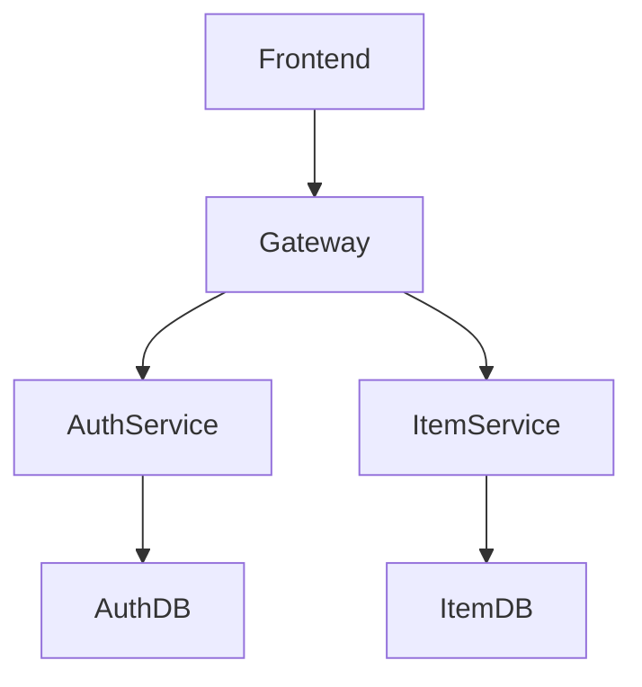

# Microservices Architecture Documentation

## 1. Introduction

Dokumentasi ini dibuat untuk menjelaskan implementasi arsitektur microservices pada aplikasi Kelarin.  
Pada modul ini, backend monolith dipecah menjadi beberapa service independen agar sistem lebih modular, scalable, dan mudah dikelola.

Arsitektur microservices pada project ini terdiri dari:
- Auth Service
- Item Service
- API Gateway (Nginx)
- Database terpisah untuk setiap service
- Frontend Application

---

# 2. Architecture Overview

## Microservices Architecture Diagram

---

# 3. Service Overview

| Service | Port | Description |
|----------|------|-------------|
| Frontend | 80 | User interface aplikasi |
| Gateway (Nginx) | 80 | API Gateway dan reverse proxy |
| Auth Service | 8001 | Authentication dan authorization service |
| Item Service | 8002 | CRUD item management |
| Auth Database | 5432 | Database khusus authentication |
| Item Database | 5432 | Database khusus item service |

---

# 4. API Contract

## Auth Service

| Method | Endpoint | Description |
|---------|-----------|-------------|
| POST | `/register` | Register user baru |
| POST | `/login` | Login user |
| GET | `/verify` | Verifikasi JWT token |
| GET | `/health` | Healthcheck auth-service |

---

## Item Service

| Method | Endpoint | Description |
|---------|-----------|-------------|
| GET | `/items` | Menampilkan seluruh item |
| POST | `/items` | Menambahkan item baru |
| PUT | `/items/{id}` | Mengubah item |
| DELETE | `/items/{id}` | Menghapus item |
| GET | `/health` | Healthcheck task-service |

---

# 5. Docker Compose Workflow

| Command | Description |
|----------|-------------|
| `docker compose up --build` | Menjalankan seluruh container microservices |
| `docker compose down` | Menghentikan seluruh container |
| `docker compose ps` | Melihat status container |
| `docker compose logs auth-service` | Melihat logs auth-service |
| `docker compose logs task-service` | Melihat logs task-service |

---

# 6. Healthcheck & Monitoring

## Health Endpoint

| Service | Endpoint | Status |
|----------|-----------|--------|
| Auth Service | `/health` | ✅ Active |
| Item Service | `/health` | ✅ Active |

---

## Monitoring Logs

| Command | Function |
|----------|----------|
| `docker compose logs auth-service` | Monitoring auth-service |
| `docker compose logs task-service` | Monitoring task-service |

---

# 7. Testing Validation

## Docker Compose Validation

| Service | Status |
|----------|--------|
| auth-service | ✅ Healthy |
| task-service | ✅ Healthy |
| auth-db | ✅ Healthy |
| task-db | ✅ Healthy |
| frontend | ✅ Running |
| gateway-nginx | ✅ Running |

### Keterangan

- Seluruh container berhasil dijalankan menggunakan Docker Compose.
- Healthcheck service menunjukkan status healthy.
- Tidak ditemukan crash pada service utama.

---

## Health Endpoint Testing

| Test Case | Result |
|------------|--------|
| Auth Service `/health` accessible | ✅ Passed |
| Item Service `/health` accessible | ✅ Passed |
| Health status returns `200 OK` | ✅ Passed |

### Keterangan

- Endpoint health berhasil diakses melalui Swagger dan Docker healthcheck.
- Service memberikan response `200 OK`.
- Monitoring service berjalan dengan normal tanpa error.

---

## Feature Testing

| Feature | Result |
|----------|--------|
| Register User | ✅ Passed |
| Login User | ✅ Passed |
| Create Item | ✅ Passed |
| Read Item | ✅ Passed |
| Update Item | ✅ Passed |
| Delete Item | ✅ Passed |

### Keterangan

- Seluruh fitur utama aplikasi berhasil berjalan pada implementasi microservices.
- Frontend berhasil terhubung dengan API Gateway dan backend services.

---

# 8. Development vs Microservices Comparison

| Component | Monolith Architecture | Microservices Architecture |
|------------|----------------------|----------------------------|
| Backend Structure | Single backend | Multiple independent services |
| Database | Single database | Database per service |
| Deployment | Single container | Multi-container |
| Scalability | Limited | More scalable |
| Fault Isolation | Single point of failure | Service isolation |

---

# 9. Documentation Evidence

| Testing Activity | Evidence | Description |
|------------------|----------|-------------|
| Docker Compose Validation |  | Pengujian dilakukan menggunakan perintah `docker compose ps` untuk memastikan seluruh container microservices berjalan dengan status running dan healthy. |
| Auth Service Healthcheck |  | Pengujian dilakukan pada endpoint `/health` auth-service melalui Swagger untuk memastikan service authentication berjalan normal dengan response `200 OK`. |
| Item Service Healthcheck |  | Pengujian dilakukan pada endpoint `/health` task-service untuk memastikan service item management berjalan normal tanpa error. |
| User Registration Testing |  | Pengujian dimulai dengan membuat akun baru melalui halaman registrasi untuk memastikan auth-service dapat menyimpan data user dengan baik. |
| User Login Testing |  | Pengujian dilakukan menggunakan akun yang telah terdaftar untuk memastikan proses authentication dan JWT token berjalan normal. |
| Create Item Testing |  | Pengujian dilakukan dengan menambahkan item baru pada aplikasi untuk memastikan task-service dapat menerima dan menyimpan data dengan baik. |
| Read Item Testing |  | Pengujian dilakukan untuk memastikan item yang telah dibuat berhasil ditampilkan pada frontend application. |
| Update Item Testing |  | Pengujian dilakukan dengan mengubah data item untuk memastikan fitur update berjalan normal pada microservices architecture. |
| Delete Item Testing |  | Pengujian dilakukan dengan menghapus item dari sistem untuk memastikan delete endpoint berjalan dengan baik tanpa error. |
| Frontend Microservices Testing |  | Pengujian dilakukan dengan membuka aplikasi melalui gateway nginx untuk memastikan frontend berhasil terhubung dengan backend microservices. |

---

# 10. Debugging Guide

| Problem | Solution |
|----------|----------|
| Container tidak berjalan | Jalankan `docker compose up --build` |
| Service unhealthy | Cek logs menggunakan `docker compose logs <service-name>` |
| Frontend tidak dapat connect backend | Periksa konfigurasi gateway nginx |
| Endpoint tidak dapat diakses | Pastikan container running dan network Docker aktif |

---

# 11. Conclusion

Implementasi microservices pada aplikasi Kelarin berhasil dijalankan menggunakan Docker Compose dengan arsitektur multi-service.

Seluruh service:
- berhasil berjalan
- saling terhubung
- memiliki healthcheck
- dapat melakukan komunikasi antar service dengan normal

Pengujian fitur utama aplikasi menunjukkan bahwa sistem berjalan stabil pada implementasi microservices.

---

# Final Status

🟢 MICROSERVICES ARCHITECTURE RUNNING SUCCESSFULLY