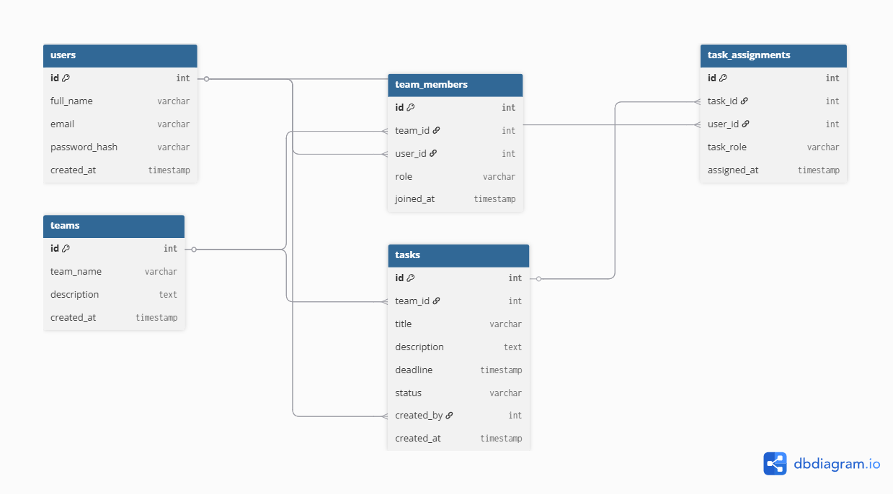

# **Skema Database Kelarin**

## **1. Gambaran Dokumen dan Konteks Sistem**

Dokumen ini merupakan spesifikasi formal skema database untuk proyek **Kelarin**, yaitu sistem manajemen tugas kolaboratif berbasis cloud yang dirancang untuk lingkungan akademik.

*Gambar 1. Diagram Entity Relationship dari Skema Database Kelarin*

---

## **2. Gambaran Entity Relationship**

Skema ini dirancang mengikuti prinsip **Third Normal Form (3NF)**.

### **2.1 Lapisan Relasi**

#### **Entitas Utama**

* **users** → Identitas mahasiswa & autentikasi
* **teams** → Ruang kerja kelompok
* **tasks** → Unit pekerjaan dalam suatu tim

#### **Tabel Junction / Pivot**

* **team_members** → Menyelesaikan relasi M:M (users ↔ teams)
* **task_assignments** → Menyelesaikan relasi M:M (users ↔ tasks), serta mendefinisikan peran spesifik

---

### **2.2 Ringkasan Relasi**

* **Users ↔ Teams (M:M)**
  → melalui `team_members`

* **Teams → Tasks (1:M)**
  → Satu tim memiliki banyak tugas

* **Users → Tasks (Pembuat) (1:M)**
  → melalui `created_by`

* **Users ↔ Tasks (Penugasan) (M:M)**
  → melalui `task_assignments`

---

## **3. Kamus Data (Data Dictionary)**

### **3.1 Tabel: users (Data Mahasiswa)**

| Nama Kolom    | Tipe Data    | Deskripsi / Constraint | Aturan / Validasi               |
| ------------- | ------------ | ---------------------- | ------------------------------- |
| id            | INT          | PK, Auto-increment     | Identifier unik                 |
| full_name     | VARCHAR(100) | NOT NULL               | min_length=2, max_length=100    |
| email         | VARCHAR(255) | NOT NULL, UNIQUE       | Harus format email valid        |
| password_hash | VARCHAR(255) | NOT NULL               | Hash bcrypt, input min_length=8 |
| created_at    | TIMESTAMP    | NOT NULL               | Default: CURRENT_TIMESTAMP      |

---

### **3.2 Tabel: teams (Data Kelompok)**

| Nama Kolom  | Tipe Data    | Deskripsi / Constraint | Aturan          |
| ----------- | ------------ | ---------------------- | --------------- |
| id          | INT          | PK, Auto-increment     | Identifier unik |
| team_name   | VARCHAR(100) | NOT NULL               | —               |
| description | TEXT         | NULLABLE               | Opsional        |
| created_at  | TIMESTAMP    | NOT NULL               | —               |

---

### **3.3 Tabel: team_members (Keanggotaan Tim)**

| Nama Kolom | Tipe Data   | Deskripsi / Constraint | Aturan             |
| ---------- | ----------- | ---------------------- | ------------------ |
| id         | INT         | PK, Auto-increment     | —                  |
| team_id    | INT         | FK → teams(id)         | NOT NULL           |
| user_id    | INT         | FK → users(id)         | NOT NULL           |
| role       | VARCHAR(50) | NOT NULL               | "Ketua", "Anggota" |
| joined_at  | TIMESTAMP   | NOT NULL               | —                  |

---

### **3.4 Tabel: tasks (Daftar Tugas)**

| Nama Kolom  | Tipe Data    | Deskripsi / Constraint | Aturan                         |
| ----------- | ------------ | ---------------------- | ------------------------------ |
| id          | INT          | PK, Auto-increment     | —                              |
| team_id     | INT          | FK → teams(id)         | NOT NULL                       |
| title       | VARCHAR(100) | NOT NULL               | min_length=1, max_length=100   |
| description | TEXT         | NULLABLE               | —                              |
| deadline    | TIMESTAMP    | NOT NULL               | —                              |
| status      | VARCHAR(20)  | NOT NULL               | 'To Do', 'In Progress', 'Done' |
| created_by  | INT          | FK → users(id)         | NOT NULL                       |
| created_at  | TIMESTAMP    | NOT NULL               | —                              |

---

### **3.5 Tabel: task_assignments (Penugasan Tugas)**

| Nama Kolom  | Tipe Data    | Deskripsi / Constraint | Aturan                       |
| ----------- | ------------ | ---------------------- | ---------------------------- |
| id          | INT          | PK, Auto-increment     | —                            |
| task_id     | INT          | FK → tasks(id)         | NOT NULL                     |
| user_id     | INT          | FK → users(id)         | NOT NULL                     |
| task_role   | VARCHAR(100) | NOT NULL               | contoh: "Bikin PPT", "Bab 1" |
| assigned_at | TIMESTAMP    | NOT NULL               | —                            |