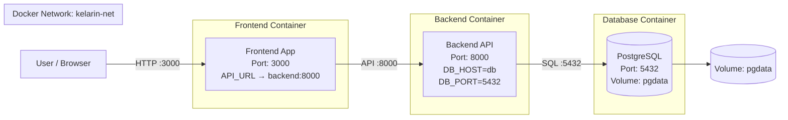

# Docker Architecture (3-Container Setup)

Dokumen ini menjelaskan arsitektur aplikasi berbasis Docker yang terdiri dari tiga container utama, yaitu frontend, backend, dan database. Arsitektur ini dirancang untuk memisahkan setiap komponen aplikasi agar lebih terstruktur, mudah dikembangkan, serta mudah untuk dideploy dalam lingkungan container.

Selain itu, dokumentasi ini juga menjelaskan bagaimana setiap container saling terhubung melalui network, bagaimana data disimpan menggunakan volume, serta bagaimana konfigurasi dilakukan menggunakan environment variables.

---

## Tujuan Arsitektur

Arsitektur ini dibuat dengan tujuan:
- Memisahkan tanggung jawab setiap komponen (frontend, backend, database)
- Mempermudah proses deployment menggunakan Docker
- Memastikan data tetap aman menggunakan volume
- Memungkinkan komunikasi antar container melalui Docker network

---

## Diagram Arsitektur



## Penjelasan Arsitektur

Arsitektur ini terdiri dari tiga container yang masing-masing memiliki peran yang berbeda namun saling terhubung.

### 1. Frontend Container

Frontend merupakan bagian yang berinteraksi langsung dengan user. Biasanya berupa aplikasi web yang berjalan di browser.

**Detail konfigurasi:**

- Port: 3000
- Diakses melalui browser oleh user
- Menggunakan environment variable:
    - API_URL=http://backend:8000

**Penjelasan:**

Frontend mengirimkan request ke backend untuk mengambil atau mengirim data. Karena berjalan dalam Docker network yang sama, frontend tidak menggunakan localhost, tetapi menggunakan nama service yaitu backend.

## 2. Backend Container

Backend berfungsi sebagai penghubung antara frontend dan database. Backend menangani logika aplikasi, validasi data, dan komunikasi dengan database.

**Detail konfigurasi:**

- Port: 8000
- Environment variables:
- DB_HOST=db
- DB_PORT=5432
- DB_USER=postgres
- DB_PASSWORD=***
- DB_NAME=kelarin

**Penjelasan:**

Backend menggunakan DB_HOST=db karena dalam Docker, setiap container bisa saling mengakses menggunakan nama servicenya. Backend akan menerima request dari frontend, memprosesnya, lalu melakukan query ke database jika diperlukan.

## 3. Database Container (PostgreSQL)

Database digunakan untuk menyimpan seluruh data aplikasi secara permanen.

**Detail konfigurasi:**

- Port: 5432
- Volume: pgdata
- Environment variables:
- POSTGRES_USER=postgres
- POSTGRES_PASSWORD=***
- POSTGRES_DB=kelarin

**Penjelasan:**

Database berjalan dalam container terpisah agar lebih aman dan terisolasi. Data disimpan menggunakan volume pgdata sehingga tidak akan hilang meskipun container dihentikan atau dihapus.

## Penjelasan Network

Semua container berada dalam satu Docker network bernama:

```
kelarin-net
```

**Fungsi network:**

- Menghubungkan semua container
- Memungkinkan komunikasi antar container
- Menggunakan service name sebagai hostname

**Contoh:**

- Backend mengakses database dengan db
- Frontend mengakses backend dengan backend

## Penjelasan Volume

Volume digunakan untuk menyimpan data secara persisten.

**Volume yang digunakan:**

```
pgdata
```

**Fungsi:**

- Menyimpan data database
- Mencegah kehilangan data saat container dihapus
- Memungkinkan reuse data

## Alur Kerja Sistem
1. User mengakses aplikasi melalui browser di port 3000
2. Frontend menerima request dari user
3. Frontend mengirim request ke backend melalui port 8000
4. Backend memproses request
5. Jika membutuhkan data, backend mengakses database melalui port 5432
6. Database mengembalikan data ke backend
7. Backend mengirim response ke frontend
8. Frontend menampilkan hasil ke user

## Kesimpulan

Arsitektur 3-container ini memberikan pemisahan yang jelas antara frontend, backend, dan database. Dengan menggunakan Docker network, setiap container dapat saling berkomunikasi dengan mudah. Selain itu, penggunaan volume memastikan data tetap aman dan tidak hilang.

Pendekatan ini sangat cocok digunakan dalam pengembangan aplikasi modern karena lebih modular, scalable, dan mudah dikelola.