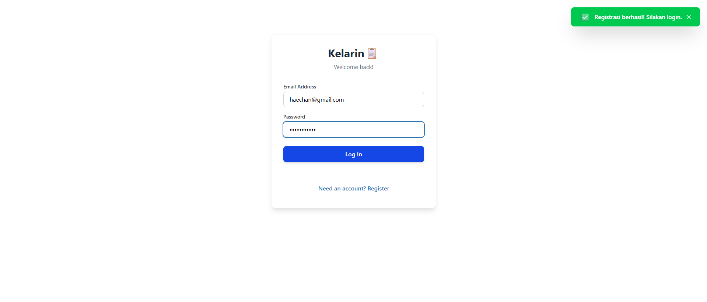
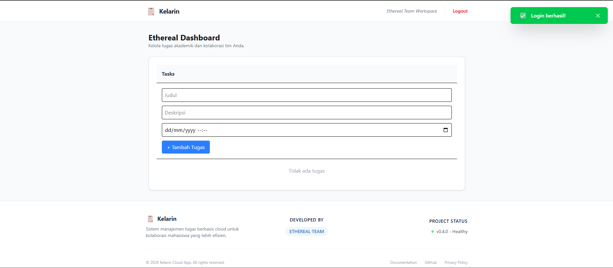
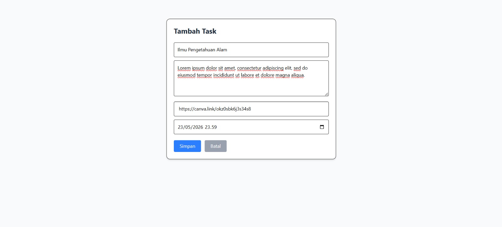
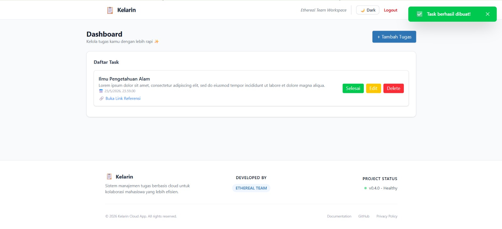
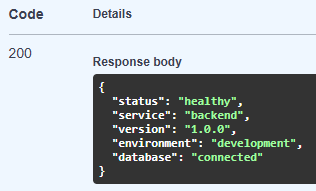
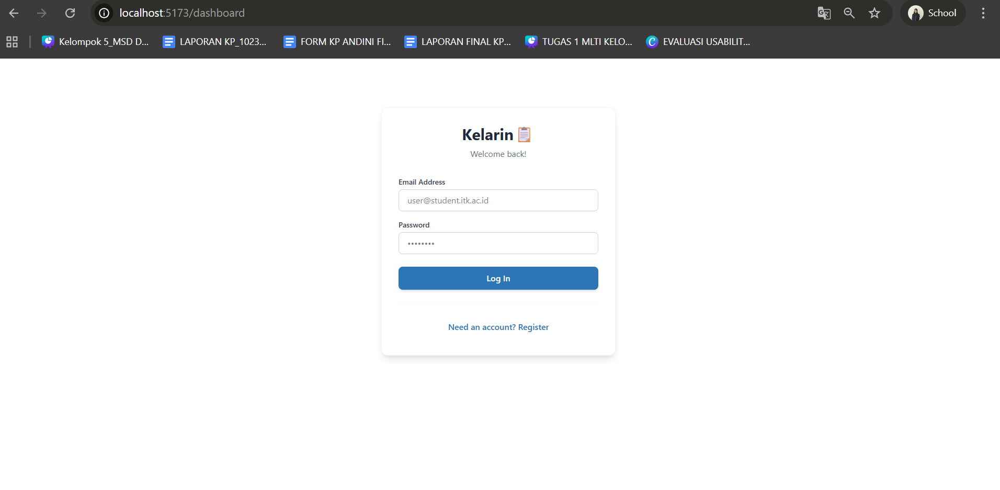

# Production Testing

Dokumen ini berisi hasil pengujian aplikasi **Kelarin** pada environment production yang telah di-deploy menggunakan Railway. Pengujian dilakukan untuk memastikan seluruh fitur utama aplikasi berjalan dengan baik pada production environment.

---

# Testing Environment

| Environment | URL                      | Status    |
| ----------- | ------------------------ | --------- |
| Development | Local Docker Environment | ✅ Running |
| Production  | Railway Deployment       | ✅ Running |

---
# Docker & Monitoring Validation (Local Environment Pre-Check)

## Docker Container Status

Pengujian dilakukan menggunakan command:

```bash
docker compose ps
```

Hasil:

* Seluruh container berjalan dengan status healthy/running.
* Tidak terdapat container yang crash atau restart berulang.

---

## Backend Logs Validation

Pengujian dilakukan menggunakan command:

```bash
docker logs backend
```

Hasil:

* Backend service berjalan dengan normal.
* Tidak ditemukan error critical pada logs.
* Database connection berhasil.
* API service dapat menerima request dengan baik.

---

# Production Feature Testing

## 1. Frontend Production Access

| Test Case                 | Result   |
| ------------------------- | -------- |
| Frontend berhasil diakses | ✅ Passed |
| Halaman load tanpa error  | ✅ Passed |

Keterangan:

* Frontend production berhasil dibuka melalui Railway deployment URL.
* Tidak ditemukan blank page atau crash saat halaman pertama dibuka.

---

## 2. User Registration

| Test Case          | Result   |
| ------------------ | -------- |
| Register user baru | ✅ Passed |

Keterangan:

* User baru berhasil dibuat pada production environment.

---

## 3. User Login

| Test Case                        | Result   |
| -------------------------------- | -------- |
| Login menggunakan akun terdaftar | ✅ Passed |

Keterangan:

* Sistem authentication berjalan dengan normal.

---

## 4. Create Task

| Test Case             | Result   |
| --------------------- | -------- |
| Menambahkan Task baru |✅ Passed |

Keterangan:

* Task baru berhasil dibuat dan tersimpan pada database production.

---

## 5. Read Task

| Test Case               | Result   |
| ----------------------- | -------- |
| Task muncul pada daftar |✅ Passed |

Keterangan:

* Data Task berhasil ditampilkan pada frontend.

---

## 6. Edit Task

| Test Case          | Result   |
| ------------------ | -------- |
| Edit Task berhasil |✅ Passed |

Keterangan:

* Perubahan Task berhasil disimpan dan diperbarui pada database.

---

## 7. Delete Task

| Test Case           | Result   |
| ------------------- | -------- |
| Hapus Task berhasil |✅ Passed |

Keterangan:

* Task berhasil dihapus dari sistem tanpa error.

---

## 8. Health Endpoint Validation

Endpoint yang diuji:

```bash
GET /health
```

| Test Case                  | Result   |
| -------------------------- | -------- |
| Health endpoint accessible | ✅ Passed |
| Status application healthy | ✅ Passed |

Keterangan:

* Endpoint health berhasil diakses.
* Application status menunjukkan kondisi healthy.

---

# Development vs Production Comparison

| Test               | Development (localhost) | Production (Railway) | Status |
| ------------------ | ----------------------- | -------------------- | ------ |
| Backend `/health`  | ✅                       | ✅                 | Passed |
| Register user      | ✅                       | ✅                 | Passed |
| Login              | ✅                       | ✅                 | Passed |
| Create Task        | ✅                       | ✅                 | Passed |
| Read Task          | ✅                       | ✅                 | Passed |
| Update Task        | ✅                       | ✅                 | Passed |
| Delete Task        | ✅                       | ✅                 | Passed |
| Update Status Task | ✅                       | ✅                 | Passed |

## Testing Notes

* Seluruh fitur utama aplikasi berhasil dijalankan pada environment development maupun production.
* Tidak ditemukan error signifikan selama proses pengujian.
* CRUD task berjalan dengan baik pada Railway deployment.
* Health endpoint menunjukkan status healthy.
* Docker container dan backend logs berjalan stabil tanpa crash.

---

# Conclusion
Berdasarkan hasil pengujian yang telah dilakukan, aplikasi Kelarin berhasil berjalan dengan baik pada environment production berbasis Railway. Seluruh fitur utama seperti authentication, CRUD task, health endpoint, serta deployment service dapat digunakan dengan normal tanpa ditemukan error kritis selama proses testing.


## Status akhir:

🟢 PRODUCTION OK ✅

---

# 📸 Dokumentasi Hasil Testing

Berikut dokumentasi hasil pengujian aplikasi Kelarin pada production environment:


| No | Aktivitas Testing | Hasil Testing                      | Deskripsi                                                                                                                                                                                                                                                                                                                              |
| -- | ----------------- | -------------------------------- | ---------------------------------------------------------------------------------------------------------------------------------------------------------------------------------------------------------------------------------------------------------------------------------------------------------------------------------------- |
| 1  | Register User     |     | Pengujian dimulai dengan membuat akun baru melalui halaman registrasi. Username dan password dimasukkan ke dalam kolom yang tersedia. Hasilnya, data sukses terkirim ke backend dan aplikasi langsung mengarahkan ke halaman login. Proses ini memastikan pengguna baru dapat mendaftarkan akun dengan baik pada production environment. |
| 2  | Login User        |         | Pengujian dilakukan dengan memasukkan akun yang telah terdaftar pada halaman login. Setelah tombol login ditekan, sistem berhasil melakukan autentikasi dan mengarahkan pengguna ke dashboard aplikasi. Proses ini memastikan fitur login berjalan dengan normal.                                                                        |
| 3  | Dashboard Access  |      | Pengujian dilakukan dengan membuka halaman dashboard setelah proses login berhasil. Halaman dapat dimuat tanpa error maupun blank page. Proses ini memastikan frontend production dapat diakses dengan stabil.                                                                                                                           |
| 4  | Create Task       |       | Pengujian dilakukan dengan menambahkan task baru melalui form input yang tersedia pada dashboard. Setelah data disimpan, task berhasil muncul pada daftar task. Proses ini memastikan fitur create task berjalan dengan baik.                                                                                                            |
| 5  | Read Task         |     | Pengujian dilakukan dengan melihat daftar task yang telah dibuat sebelumnya. Seluruh data task berhasil ditampilkan pada frontend tanpa kendala. Proses ini memastikan data dapat dibaca dan ditampilkan dengan benar dari database production.                                                                                          |
| 6  | Update Task       |     | Pengujian dilakukan dengan mengubah isi task yang telah dibuat sebelumnya. Setelah tombol simpan ditekan, perubahan berhasil diperbarui pada daftar task. Proses ini memastikan fitur update task berjalan normal pada production environment.                                                                                           |
| 7  | Delete Task       |  | Pengujian dilakukan dengan menghapus salah satu task dari daftar task yang tersedia. Setelah proses delete dilakukan, task berhasil hilang dari daftar tanpa error. Proses ini memastikan fitur delete task berjalan dengan baik.                                                                                                        |
| 8  | Health Endpoint   |     | Pengujian dilakukan dengan mengakses endpoint `/health` pada backend production. Endpoint berhasil memberikan response healthy tanpa kendala. Proses ini memastikan backend service berjalan dengan stabil.                                                                                                                              |
| 9  | Docker Validation |            | Pengujian dilakukan dengan menjalankan perintah `docker compose ps` pada terminal untuk memeriksa status container. Hasil menunjukkan seluruh container berjalan dengan status running. Proses ini memastikan service Docker berjalan normal.                                                                                                    |
| 10 | Backend Logs      |  | Pengujian dilakukan dengan menjalankan perintah `docker logs backend` untuk memantau aktivitas backend service. Log aplikasi menunjukkan backend berjalan tanpa error critical maupun crash. Proses ini memastikan backend service berjalan stabil pada production environment.                                                          |

Dokumentasi screenshot pengujian disimpan sebagai bukti validasi bahwa aplikasi berhasil berjalan dengan baik pada environment production.