# TEST CASE CLOUD APP

## 1. Menambahkan Item Baru dengan Mengisi semua kolom
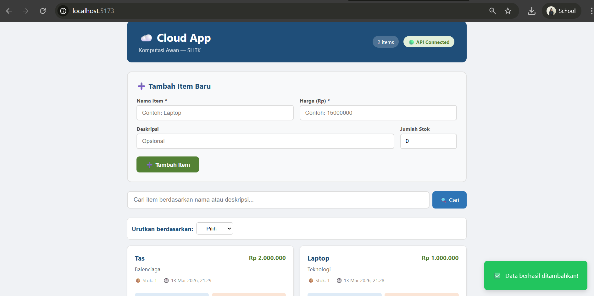
Test case ini bertujuan untuk memastikan bahwa sistem dapat menyimpan data item baru ketika semua kolom diisi dengan benar. Pengguna memasukkan nama item, harga, deskripsi, dan jumlah stok, lalu menekan tombol Tambah Item. Jika berhasil, data akan tersimpan dan muncul di daftar item, serta sistem menampilkan notifikasi bahwa data berhasil ditambahkan.

## 2. Menambahkan Item Baru tanpa mengisi kolom Nama item
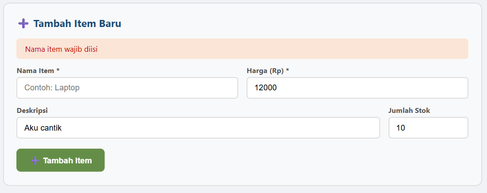
Test ini dilakukan untuk memastikan sistem melakukan validasi terhadap kolom yang wajib diisi. Ketika pengguna tidak mengisi kolom Nama Item lalu mencoba menambahkan item, sistem harus menolak proses tersebut dan menampilkan pesan bahwa nama item wajib diisi. Dengan begitu data yang tidak lengkap tidak akan tersimpan.

## 3. Menambahkan Item Baru tanpa mengisi kolom Harga
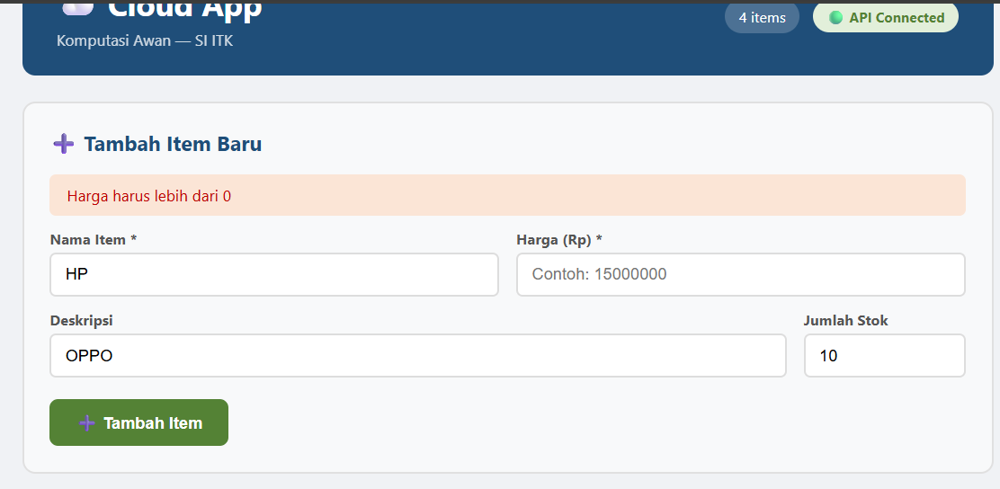
Test case ini bertujuan untuk mengecek validasi pada kolom harga. Jika pengguna tidak mengisi harga atau memasukkan nilai yang tidak valid, sistem harus menampilkan pesan error seperti harga harus lebih dari 0. Hal ini untuk memastikan bahwa setiap item memiliki nilai harga yang valid sebelum disimpan.

## 4. Mencari Item dari Search Bar
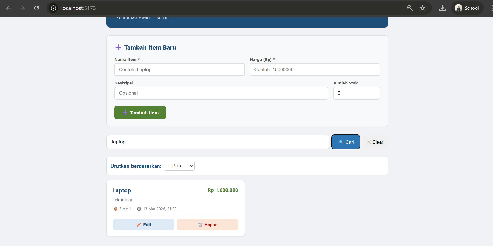
Pengujian ini dilakukan untuk memastikan fitur pencarian berjalan dengan baik. Pengguna memasukkan kata kunci pada kolom pencarian, misalnya nama item tertentu. Sistem kemudian akan menampilkan item yang sesuai dengan kata kunci tersebut sehingga pengguna bisa menemukan data dengan lebih cepat.

## 5. Mencari Item berdasarkan urutan Harga
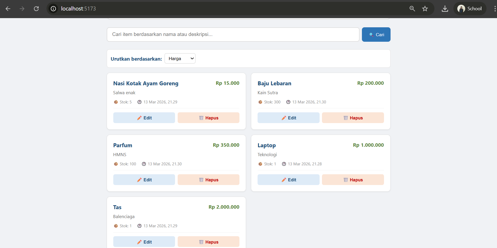
Test ini bertujuan untuk memastikan fitur sorting berdasarkan harga bekerja dengan benar. Ketika pengguna memilih opsi urutkan berdasarkan harga, sistem akan menampilkan daftar item yang sudah diurutkan sesuai nilai harga. Pada tampilan diatas, sistem menampilkan item dari harga terendah ke tertinggi.

## 6. Mencari Item berdasarkan urutan Nama
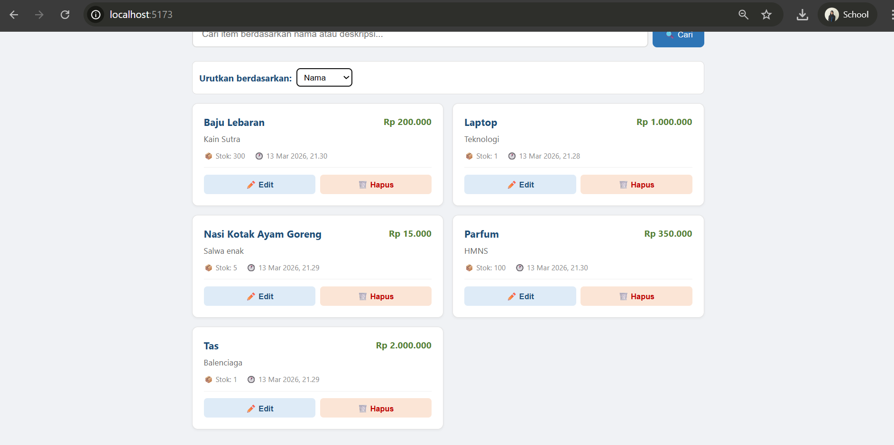
Pengujian ini memastikan sistem dapat mengurutkan item berdasarkan nama. Saat pengguna memilih opsi Nama, sistem akan menampilkan daftar item dalam urutan alfabet sehingga lebih mudah untuk mencari item tertentu.

## 7. Mencari Item berdasarkan urutan Terbaru
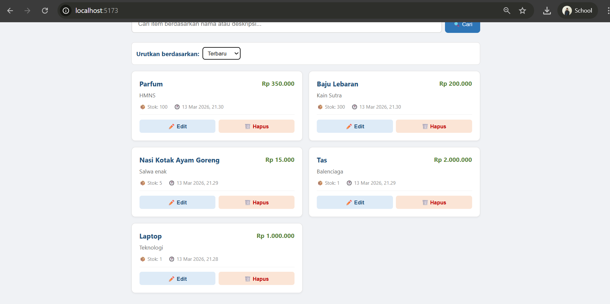
Test ini bertujuan untuk mengecek apakah sistem dapat menampilkan item berdasarkan waktu penambahan terbaru. Ketika opsi Terbaru dipilih, item yang paling baru ditambahkan akan muncul di bagian atas daftar.

## 8. Memperbarui Item
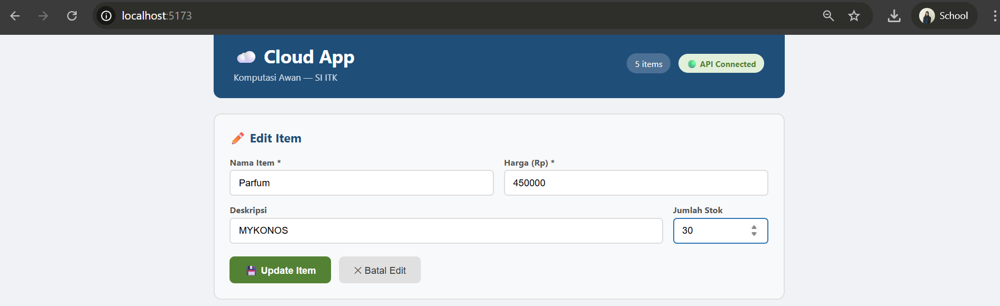
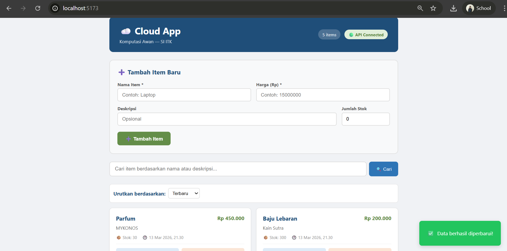
Pengujian ini dilakukan untuk memastikan pengguna dapat mengubah data item yang sudah ada. Pengguna memilih tombol Edit, mengubah data seperti nama, harga, atau stok, lalu menekan Update Item. Jika berhasil, sistem akan menyimpan perubahan tersebut dan menampilkan notifikasi bahwa data berhasil diperbarui.

## 9. Menghapus Item
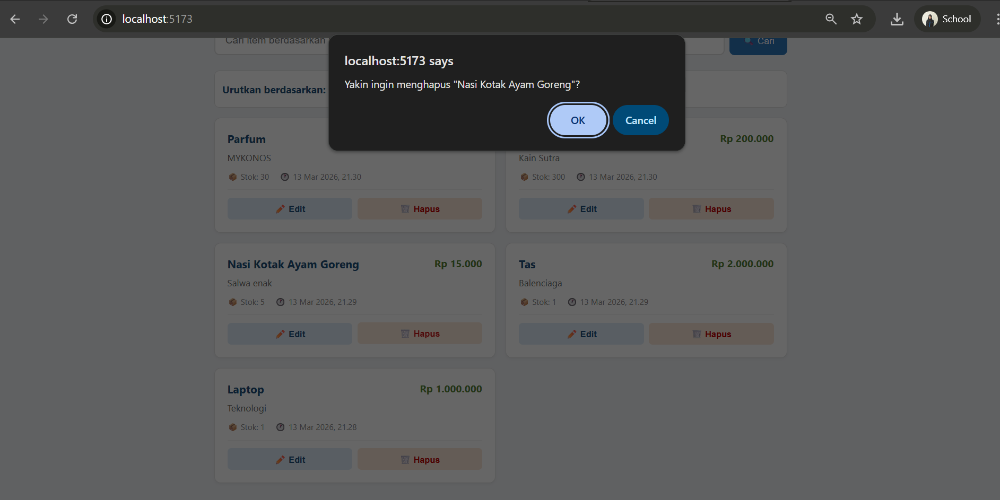
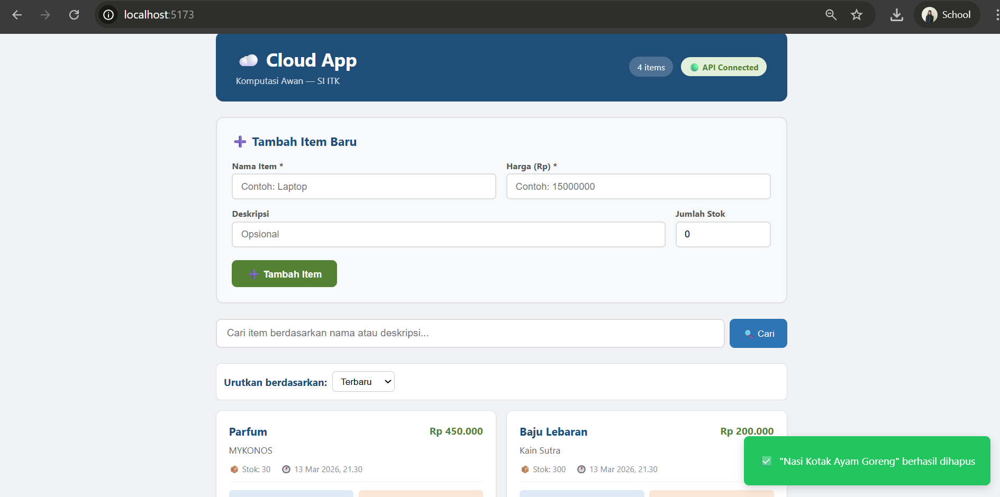
Test case ini bertujuan untuk memastikan fitur penghapusan item berjalan dengan benar. Saat pengguna menekan tombol Hapus, sistem akan menampilkan konfirmasi terlebih dahulu. Jika pengguna menekan OK, maka item akan dihapus dari daftar dan sistem menampilkan notifikasi bahwa item berhasil dihapus.

## 10. Test API Get/Item/Stats
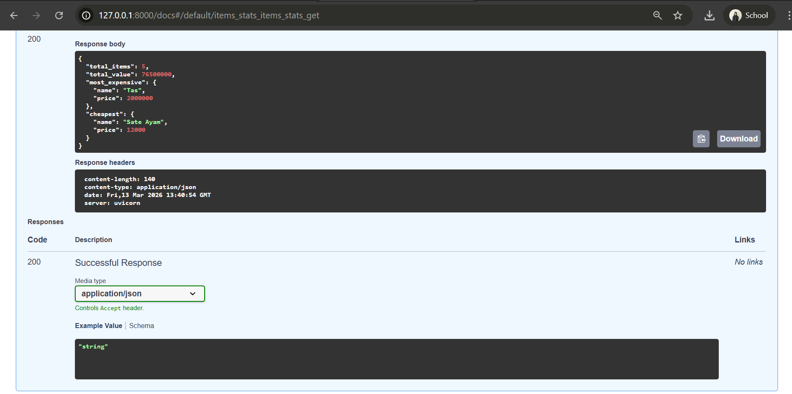
Pengujian ini dilakukan untuk memastikan endpoint API /item/stats dapat berjalan dengan baik. Ketika endpoint dipanggil, sistem akan mengembalikan response berupa data statistik item dalam format JSON, seperti total item, item dengan harga tertinggi, dan item dengan harga terendah. Jika response berhasil ditampilkan dengan status kode 200, maka API dianggap berjalan dengan baik