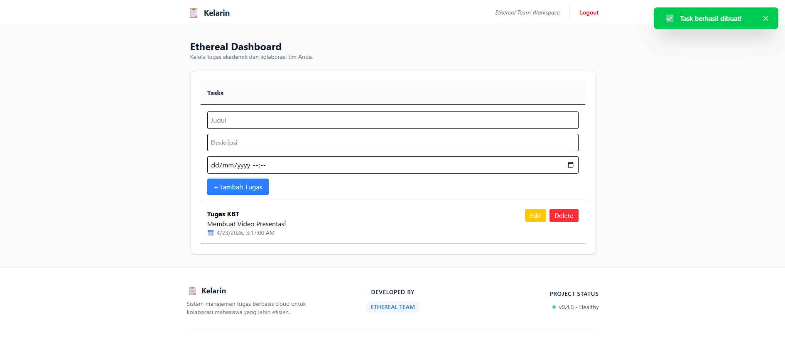
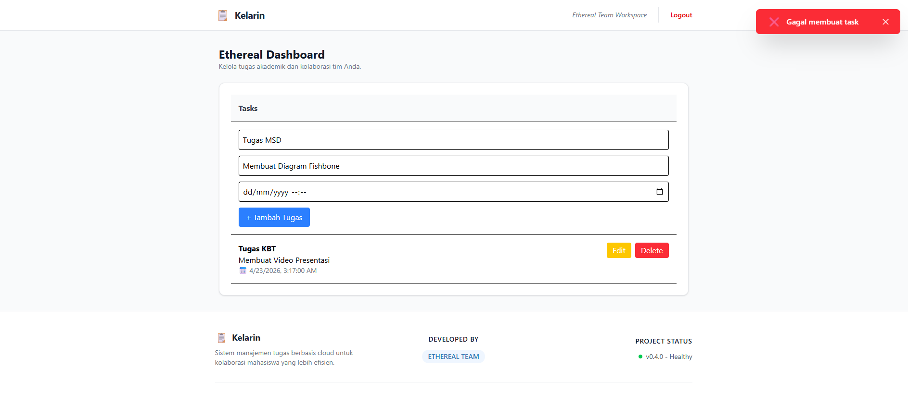
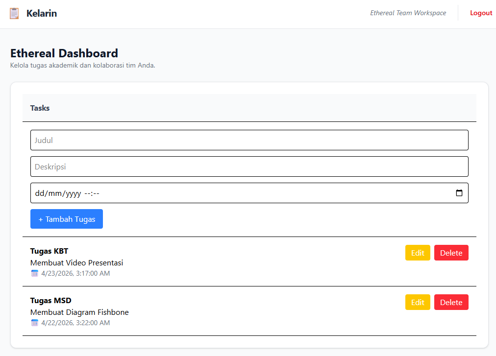
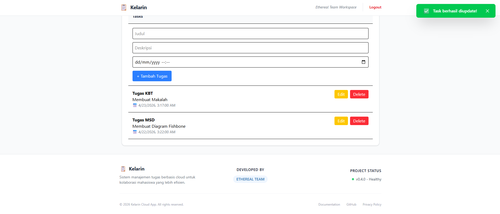
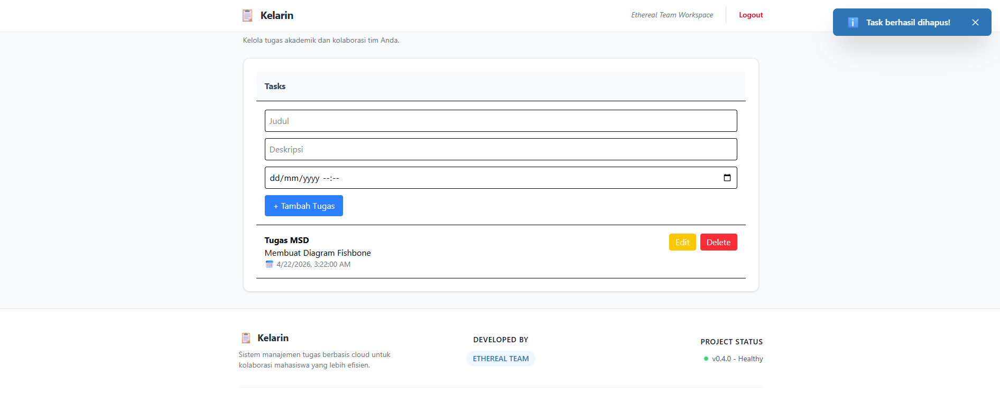
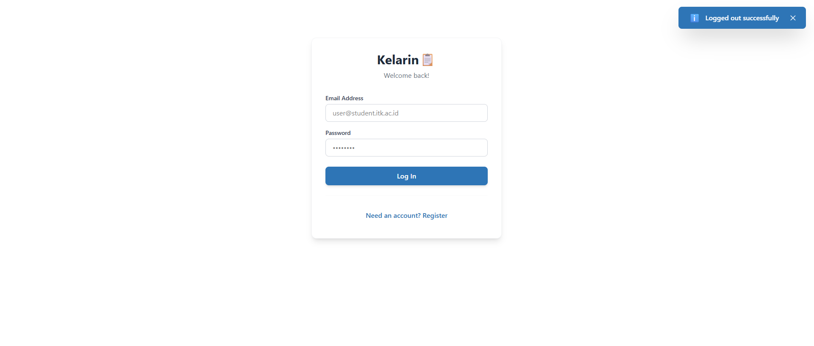
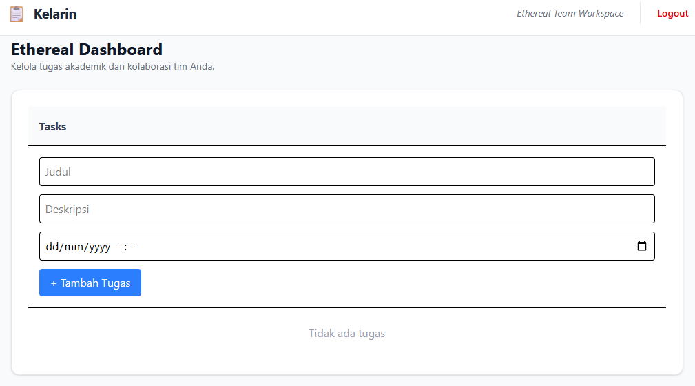

# Test Case Project Kelarin

## 📋 Ringkasan Test Case

Dokumen ini berisi hasil pengujian antarmuka pengguna (UI) aplikasi Kelarin untuk memverifikasi alur autentikasi dan manajemen tugas (CRUD).

## 📋 Ringkasan Test Case (CRUD + Auth)

| ID | Test Case | Ekspektasi Hasil | Status |
| :--- | :--- | :--- | :--- |
| **TC-01** | Register User Baru | User berhasil terdaftar & diarahkan ke login | ✅ Pass |
| **TC-02** | Login User | Berhasil masuk & token JWT tersimpan | ✅ Pass |
| **TC-03** | Proteksi Route | Halaman dashboard tidak bisa diakses sebelum login | ✅ Pass |
| **TC-04** | Tambah Tugas (Create) | Tugas baru muncul di dashboard | ✅ Pass |
| **TC-05** | Validasi Input | Form kosong/tidak valid memunculkan error | ✅ Pass |
| **TC-06** | Tampil Tugas (Read) | Daftar tugas muncul dengan benar | ✅ Pass |
| **TC-07** | Edit Tugas (Update) | Data tugas berubah setelah diedit | ✅ Pass |
| **TC-08** | Hapus Tugas (Delete) | Tugas hilang dari list setelah konfirmasi | ✅ Pass |
| **TC-09** | Logout | Token dihapus & user diarahkan ke login | ✅ Pass |
| **TC-10** | Empty State | Pesan "Belum ada tugas" jika belum ada data | ✅ Pass |

---

## Dokumetasi Hasil Testing
Berikut adalah bukti pengujian untuk setiap *test case* yang telah dijalankan:

1.  **TC-01 (Register):** 

Pengujian dimulai dengan membuat akun baru melalui halaman registrasi. Username dan password dimasukkan ke dalam kolom yang tersedia. Hasilnya, data sukses terkirim ke backend dan aplikasi langsung mengarahkan ke halaman login. Proses ini memastikan Pengguna baru bisa mendaftarkan diri dengan mudah.

2.  **TC-02 (Login):**

Setelah akun berhasil dibuat, pengujian dilanjutkan dengan mencoba masuk menggunakan akun yang sama. Kredensial dimasukkan dengan benar, dan aplikasi berhasil memverifikasi data tersebut. Di balik layar, sistem menyimpan JSON Web Token (JWT) di browser agar aplikasi bisa mengenali sesi pengguna tanpa harus login berulang kali.

3.  **TC-03 (Proteksi Route):**

Percobaan dilakukan dengan mengetik langsung alamat /dashboard di browser saat kondisi sedang logout. Hasilnya, aplikasi langsung menolak akses tersebut dan secara otomatis membuang kembali ke halaman login. Keamanan halaman utama benar-benar terjaga.

4.  **TC-04 (Create):**

Fitur tambah tugas diuji dengan mengisi judul, deskripsi, dan deadline. Setelah tombol simpan ditekan, data tersebut langsung muncul di daftar tugas pada dashboard. Ini membuktikan bahwa komunikasi antara tampilan depan dan database sudah berjalan dengan sangat mulus.

5.  **TC-05 (Validasi):**

Pengujian ini dilakukan untuk melihat seberapa tangguh aplikasi menghadapi kesalahan pengguna. Percobaan dilakukan dengan menekan tombol simpan saat kolom judul atau tanggal masih kosong. Hasilnya, muncul pesan peringatan agar kolom wajib diisi. Hal ini sangat membantu dalam mencegah masuknya data sampah ke dalam database.

6.  **TC-06 (Read):**

Untuk memastikan data bisa dibaca kembali, halaman dashboard dimuat ulang (refresh). Aplikasi berhasil menarik data dari database dan menampilkannya dengan rapi di layar sesuai dengan apa yang sebelumnya sudah disimpan

7.  **TC-07 (Update):**

Fitur edit diuji dengan mengubah status tugas yang tadinya deksripsi tugas "Membuat Video Presentasi" menjadi "Membuat Makalah". Setelah tombol simpan ditekan, perubahan data langsung terlihat di layar. Ini menunjukkan bahwa fitur edit sudah sinkron sepenuhnya antara tampilan dan database.

8.  **TC-08 (Delete):**

Pengujian dilakukan dengan menghapus salah satu tugas dari daftar. Saat tombol hapus ditekan, tugas tersebut langsung hilang dari layar dan juga terhapus dari database. Aplikasi terbukti bersih dan efisien dalam mengelola data.

9.  **TC-09 (Logout):**

Sesi diakhiri dengan menekan tombol logout. Aplikasi berhasil menghapus token sesi yang tersimpan di browser. Setelah itu, akses ke halaman dashboard otomatis terputus, sehingga harus login ulang jika ingin masuk kembali. Fitur keluar aplikasi terbukti berfungsi dengan benar.

10. **TC-10 (Empty State):**

Terakhir, pengujian dilakukan saat database dalam kondisi kosong. Ketika dashboard dibuka, aplikasi tidak menampilkan layar error atau kosong yang membingungkan, melainkan muncul pesan ramah "Tidak ada tugas". Pengalaman pengguna jadi jauh lebih baik dan informatif.